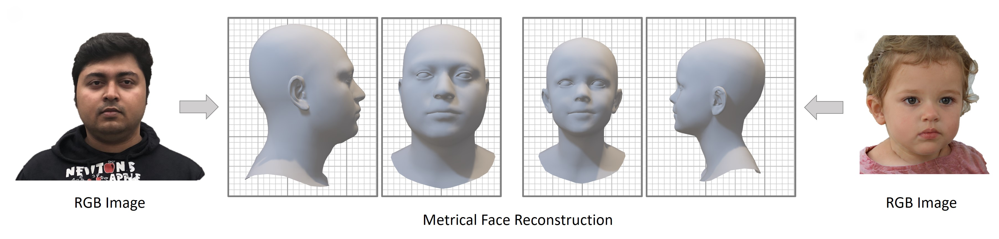

<h2 align="center"><b>MICA - Towards Metrical Reconstruction of Human Faces</b></h2>

<h4 align="center"><b><a href="https://zielon.github.io/" target="_blank">Wojciech Zielonka</a>, <a href="https://sites.google.com/site/bolkartt/" target="_blank">Timo Bolkart</a>, <a href="https://justusthies.github.io/" target="_blank">Justus Thies</a></b></h4>

<h6 align="center"><i>Max Planck Institute for Intelligent Systems, Tübingen, Germany</i></h6>

<h4 align="center">
<a href="https://youtu.be/vzzEbvv08VA" target="_blank">Video&nbsp</a>
<a href="https://arxiv.org/pdf/2204.06607.pdf" target="_blank">Paper&nbsp</a>
<a href="https://zielon.github.io/mica/" target="_blank">Project Website&nbsp</a>
<a href="https://github.com/Zielon/metrical-tracker" target="_blank">Face Tracker&nbsp</a>
<a href="https://github.com/Zielon/MICA/tree/master/datasets/" target="_blank"><b>Dataset&nbsp</b></a>
<a href="https://keeper.mpdl.mpg.de/f/6b12c44378e64738b993/" target="_blank">Supplemental&nbsp</a>
<a href="mailto:&#109;&#105;&#099;&#097;&#064;&#116;&#117;&#101;&#046;&#109;&#112;&#103;&#046;&#100;&#101;">Email</a>
</h4>

<div align="center"> 

<i style="font-size: 1.05em;">Official Repository for ECCV 2022 paper Towards Metrical Reconstruction of Human Faces</i>
</div>
<br>

<div align="center"> 
&#x26A0 The face tracker is now available under <a href="https://github.com/Zielon/metrical-tracker" target="_blank">Metrical Photometric Tracker&nbsp</a> &#x26A0
</div>

### Installation

After cloning the repository please install the environment by using attached conda `environment.yml` file with the command 
``conda env create -f environment.yml``. Additionally, the FLAME2020 model is needed. To obtain it please create an account at the [website](https://flame.is.tue.mpg.de/) download the model and place it in the `/data/pretrained/FLAME2020/` folder. 

You can also simply run the `install.sh` script:

```shell
git clone https://github.com/Zielon/MICA.git
cd MICA
./install.sh
```
you will be asked to provide `{flame_user}` and `{flame_password}` for your FLAME account in order to access the file server.

### Pre-trained Models

If you decide to not use the installation script, the pretrained model can be found under the [MPI-IS storage server](https://keeper.mpdl.mpg.de/f/db172dc4bd4f4c0f96de/?dl=1). After downloading, please place it in the `/data/pretrained/mica.tar` location. Additionally, you will need to provide models for `inisghtface`:
1) [antelopev2](https://keeper.mpdl.mpg.de/f/2d58b7fed5a74cb5be83/?dl=1)
2) [buffalo_l](https://keeper.mpdl.mpg.de/f/8faabd353cfc457fa5c5/?dl=1)

then you need to unzip them and place in `~/.insightface/models/`. The `install.sh` script does it for you.

### How To Use

To use MICA you can simply run the `demo.py` file. It will process all the images from `demo/input/` folder and create the output destination for each subject with `.ply` mesh, rendered image, and `.npy` FLAME parameters.

### Dataset and Training

The MICA dataset consists of eight smaller datasets for about 2300 subjects under a common FLAME topology. Read more information about how to obtain and use it under the [link](https://github.com/Zielon/MICA/tree/master/datasets/). To train MICA the images from all eight datasets are needed. The repository contains scripts how to generate the Arcface input images as well as the complete list of all the images used for the training. More information can be found [here](https://github.com/Zielon/MICA/tree/master/datasets).

When you train from scratch for Arcface model initialization please download [Glint360K](https://github.com/deepinsight/insightface/tree/master/recognition/arcface_torch) and specify the path to it in the config as `cfg.model.arcface_pretrained_model`.

### Testing

The testing was done using two datasets, [Stirling](http://pics.stir.ac.uk/ESRC/) and [NoW](https://now.is.tue.mpg.de/). In the [model folder](https://github.com/Zielon/MICA/tree/master/models) you can find the corresponding scripts to run testing routine, which generates the meshes. To calculate the NoW challenge error you can use the following [repository](https://github.com/soubhiksanyal/now_evaluation).   

### Citation
If you use this project in your research please cite MICA:
```bibtex
@proceedings{MICA:ECCV2022,
  author = {Zielonka, Wojciech and Bolkart, Timo and Thies, Justus},
  title = {Towards Metrical Reconstruction of Human Faces},
  journal = {European Conference on Computer Vision},
  year = {2022}
}
```
