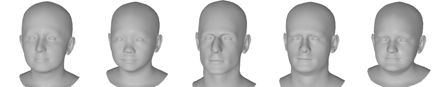
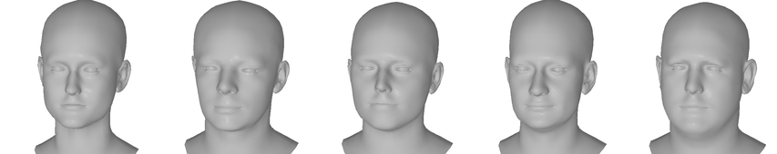
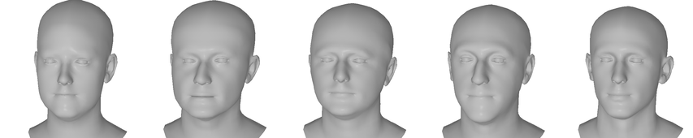
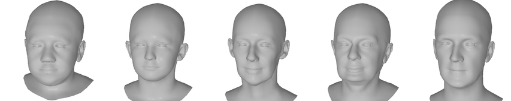
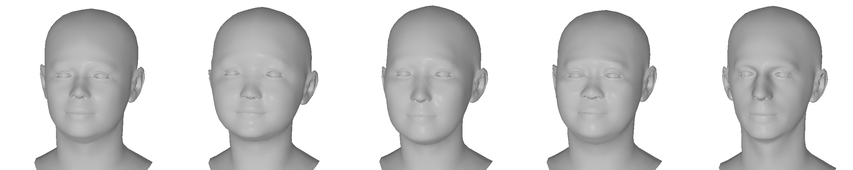
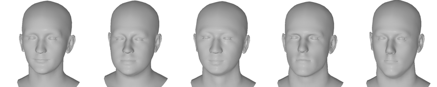

<h2 align="center"><b>MICA - Dataset</b></h2>

The <b>MICA</b> dataset consists of eight smaller datasets for about 2315 subjects, built by unifying existing small- and medium-scale datasets under a common FLAME topology. It consists of shape geometry only, therefore, to obtain images for each subject please refer to the primary dataset.

This dataset contains registration meshes together with corresponding fitted FLAME parameters. Actors are split between individual folders with a unique identifier based on the original dataset. The folder name of the parameters and mesh is the same as the ones in the analogous dataset with images. 

To obtain the dataset please follow each link separately and request the given subset.

In the case of any questions feel free to <a href="mailto:&#109;&#105;&#099;&#097;&#064;&#116;&#117;&#101;&#046;&#109;&#112;&#103;&#046;&#100;&#101;">email us</a>.

<div align="center">
<table cellspacing="0" cellpadding="0" bgcolor="#ffffff" border="0">
  <tr>
    <th>FLAME Renderings</th>
    <th>Dataset</th>
    <th>Subjects</th>
    <th>Source</th>
  </tr>
  <tr></tr>
  <tr>
    <td></td>
    <td><b>Stirling</b></td>
    <td>133</td>
    <td><a href="http://pics.stir.ac.uk/ESRC/" target="_blank">pics.stir.ac.uk</a></td>
  </tr>
  <tr></tr>
  <tr>
    <td></td>
    <td><b>D3DFACS</b></td>
    <td>10</td>
    <td><a href="https://www.cs.bath.ac.uk/~dpc/D3DFACS/" target="_blank">cs.bath.ac.uk</a></td>
  </tr>
  <tr></tr>
  <tr>
    <td></td>
    <td><b>Florence 2D/3D</b></td>
    <td>53</td>
    <td><a href="https://www.micc.unifi.it/resources/datasets/florence-3d-faces/" target="_blank">micc.unifi.it</a></td>
  </tr>
  <tr></tr>
  <tr>
    <td></td>
    <td><b>LYHM</b></td>
    <td>1211</td>
    <td><a href="https://www-users.york.ac.uk/~np7/research/Headspace/" target="_blank">cs.york.ac.uk</a></td>
  </tr>
  <tr></tr>
  <tr>
    <td></td>
    <td><b>FaceWarehouse</b></td>
    <td>150</td>
    <td><a href="http://kunzhou.net/zjugaps/facewarehouse/" target="_blank">kunzhou.net</a></td>
  </tr>
  <tr></tr>
  <tr>
    <td></td>
    <td><b><a href="https://github.com/Zielon/MICA/tree/master/datasets/#frgc-subset">*FRGC</a></b></td>
    <td>531</td>
    <td><a href="https://cvrl.nd.edu/projects/data/#face-recognition-grand-challenge-frgc-v20-data-collection" target="_blank">cvrl.nd.edu</a</td>
  </tr>
  <tr></tr>
  <tr>
    <td></td>
    <td><b><a href="https://github.com/Zielon/MICA/tree/master/datasets/#frgc-subset">*BP4D+</a></b></td>
    <td>127</td>
    <td><a href="http://www.cs.binghamton.edu/~lijun/Research/3DFE/3DFE_Analysis.html" target="_blank">cs.binghamton.edu</a></td>
  </tr>
</table>
</div>

Each subset zip file has the following structure:
```shell
root\
    FLAME_parameters\
        actor_id\
            *.npz
    registrations\
        actor_id\
            *.obj
```

To retrieve FLAME2020 parameters you can simply do:
```python
import numpy as np
import torch

params = np.load('path.npz', allow_pickle=True)
pose = torch.tensor(params['pose']).float()
betas = torch.tensor(params['betas']).float()

flame = {
    'shape_params': betas[:300],
    'expression_params': betas[300:],
    'pose_params': torch.cat([pose[:3], pose[6:9]]),
}
```

### MICA Training Dataset Preparation

To prepare the MICA training dataset you can follow the scripts from the [creation](https://github.com/Zielon/MICA/tree/master/datasets/creation) folder. Additionally, the complete list of images used for the training can be found in [image_paths](https://github.com/Zielon/MICA/tree/master/datasets/image_paths) folder. It contains the name of the FLAME parameters file `.npz` and a list of all images used for the training with their original name stored as dictionary.

### Licence
This dataset is for academic, non-commercial usage only. Moreover, it is an extension of already existing datasets, therefore, the license is shared and applies equivalently to both, the original and the corresponding derived one. Please read the original license of each original dataset for more information, especially in the context of data privacy.

### Additional Information

Please note that some subsets do not have an identical amount of subjects due to registration errors. 

#### BP4D+ Subset

The original dataset contains 140 subjects from where we selected scans in neutral pose and successfully registered 127 FLAME meshes for them.

#### FRGC Subset

1) A group desiring to obtain FLAME results on the FRGC data must license the FRGC 2.0 data set from CVRL using the licensing procedure at the website: http://cvrl.nd.edu .
2) Once the license form is completed and CVRL has approved it, an email will be sent from Globus indicating that you have been authorized to retrieve FRGC 2.0.
3) That authorization will serve as authorization to receive any derivative work, therefore, please send a confirmation to mica [AT] tue.mpg.de address to receive the MICA dataset.

### Citation
If you use this dataset in your research please cite MICA:
```bibtex
@proceedings{MICA:ECCV2022,
  author = {Zielonka, Wojciech and Bolkart, Timo and Thies, Justus},
  title = {Towards Metrical Reconstruction of Human Faces},
  journal = {European Conference on Computer Vision},
  year = {2022}
}
```
